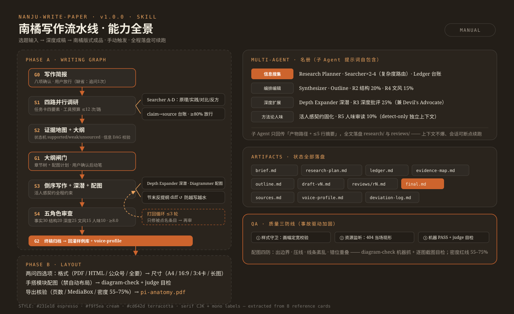
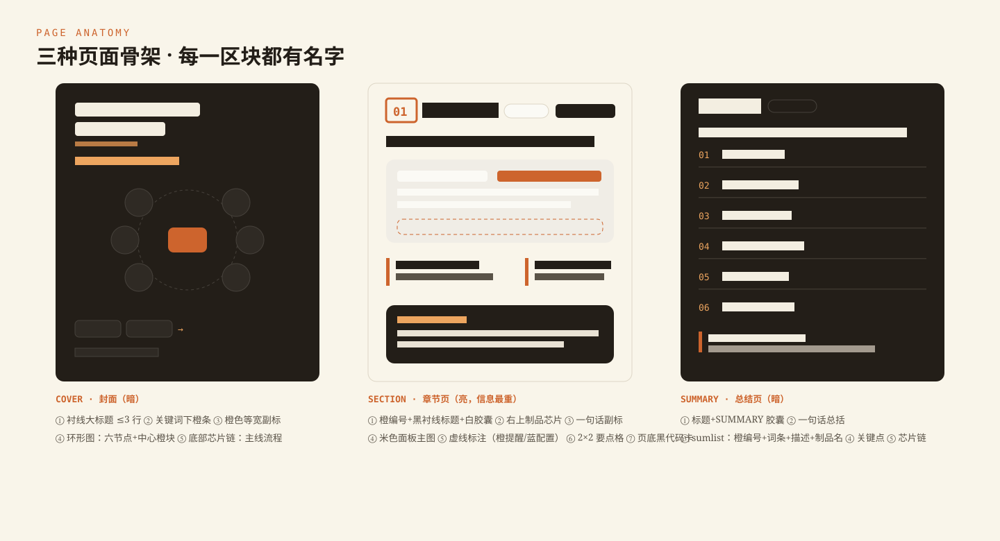
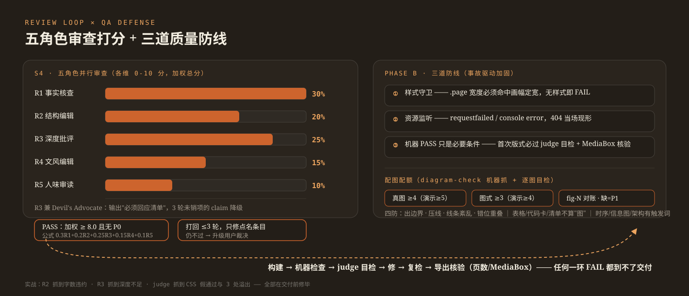
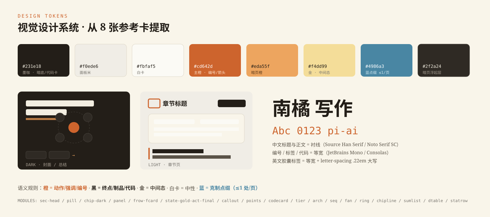
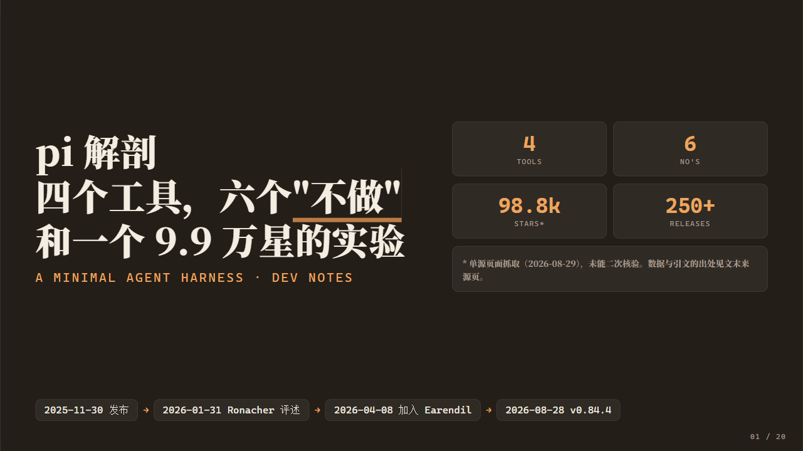
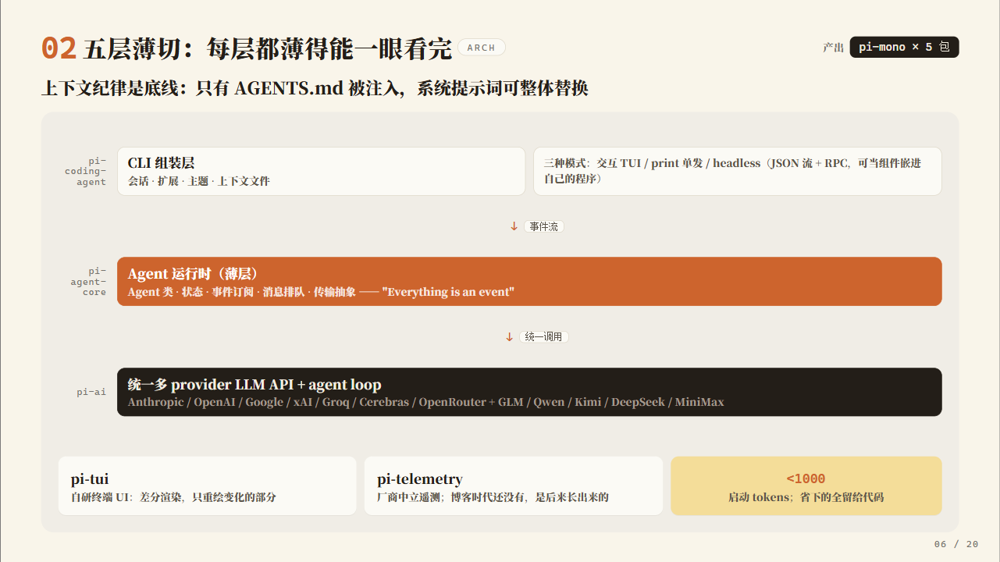
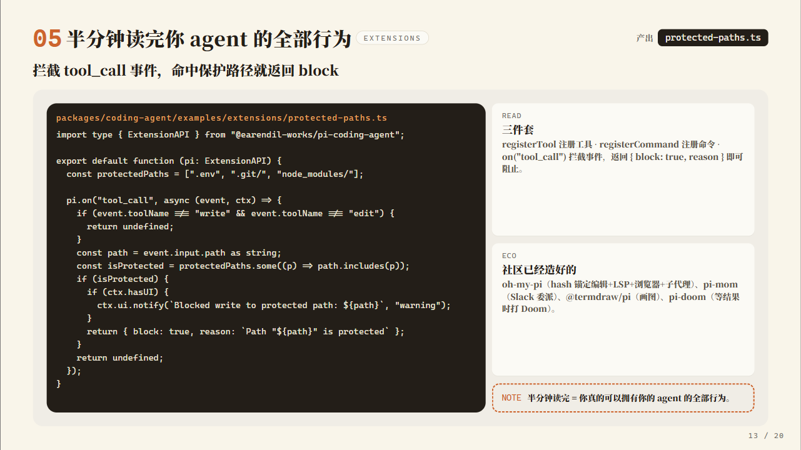
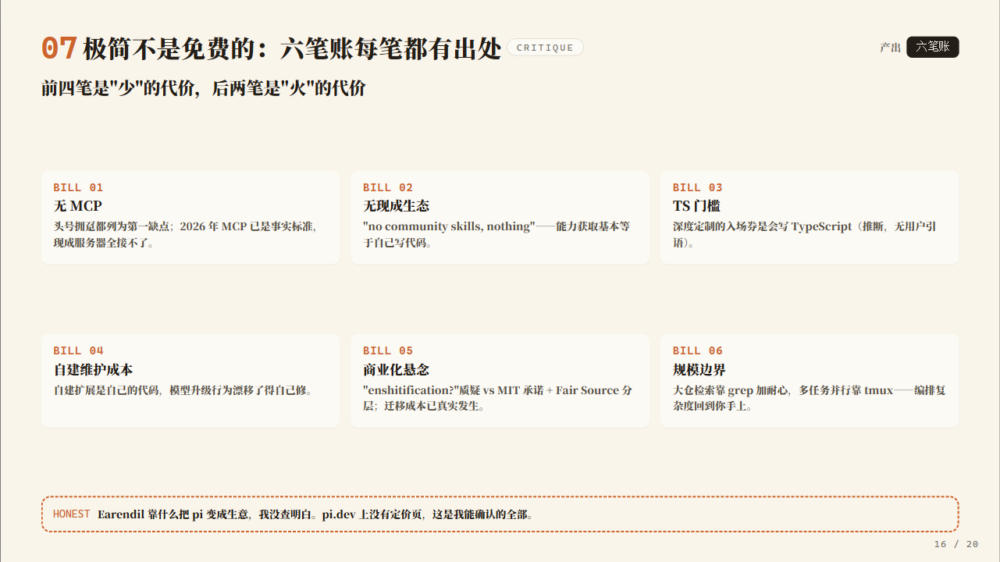

# nanju-write-paper · 南橘写作流水线

<p align="center">
  
  
  
  
  
  
  
</p>

<p align="center">
  
</p>

**一个双阶段 Agent Skill：把「选题输入」变成「深度技术长文」，再把「长文」变成「南橘卡片版式成品」。**
全程多 Agent 并行、条条素材带来源、五角色审查打分、活人感契约去 AI 味；排版阶段手搭风格化图示（架构图/流程图/时序图/汇聚图），机器检查 + 渲染目检双保险。

> 已通过端到端实战验证：7000 字《pi 解剖》→ 五角色加权 8.20 分 → 20 页 16:9 演示稿 20/20 页视觉验收通过。

---

## 它解决什么问题

| 没有 skill 时 | 有了 nanju-write-paper |
|---|---|
| AI 写长文越写越水、前后矛盾 | 节末反提纲 diff，偏离大纲当场暴露 |
| 事实无从核对，引用靠编 | claim→source 台账，核心结论 ≥2 独立来源 |
| 一股 AI 味（综上所述/值得注意的是…） | 活人感契约：30+ 黑名单、句长节奏、人味锚点密度 |
| 生成即交付，没人审 | 五角色审查加权打分，≥8.0 且无 P0 才放行，≤3 轮打回 |
| 排版是文字堆 | 南橘设计系统：橙×米色卡片、衬线+等宽、页页视觉主体 |

## 快速开始

```bash
# 1. 安装到用户级 skills 目录（Windows Git Bash）
mkdir -p /c/Users/Lenovo/.agents/skills
cp -r nanju-write-paper /c/Users/Lenovo/.agents/skills/

# 2. 在 Agent 对话里手动调用
#    写作：「用 nanju-write-paper 写一篇 <选题>」
#    排版：「用 nanju-write-paper 把 <文件.md> 排版成公众号」
```

调用后 skill 会先走闸门确认（写作简报 → 大纲），排版前固定问两个四选项问题（格式 / 画幅），不会自作主张。

## 工作流

<p align="center">
  
</p>

**Phase A · 写作**（`references/writing-graph.md`）：G0 简报闸门 → S1 四路并行调研（claim→source 台账）→ S2 证据地图 + 大纲闸门（信息 DAG 校验）→ S3 倒序写作 + 深度扩展 + 配图 → S4 五角色审查循环 → G2 终稿回灌样例库。

**Phase B · 排版**（`references/style-guide.md` + `references/md-mapping.md`）：两问四选项 → 按画幅形态转译（演示/文章/半图半文）→ 手搭模块配图 → diagram-check + judge 目检 → 导出核验。

## 配图能力（不是 Mermaid）

<p align="center">
  
</p>

所有图示用主题模块（HTML/CSS）或固定坐标 SVG 手搭，样式继承设计系统，**从构造上杜绝自动布局抽风**。四种画幅各自的形态规则（演示页页页有视觉主体、文章页图文并茂、卡片半图半文）写在 `style-guide.md` §6.8；跨介质交付的十条规范（公众号图表 PNG 化、长图限高、打印提示、降级地图…）在 §7。

## 设计系统

<p align="center">
  
</p>

深咖 `#231e18` × 米杏 `#f9f5ea` × 赤陶橙 `#cd642d`，中文衬线 + 编号/代码等宽的双字体系统，从 8 张参考卡提取（`000-reference/`）。

## 实战样例

《pi 解剖》端到端全产物在 [`writing/2026-08-29-pi-agent/`](writing/2026-08-29-pi-agent/)：写作简报、4 份调研 findings、26 条台账、证据地图、大纲、两版草稿、六份审查报告、终稿，以及 20 页 16:9 排版成品（[pi-anatomy.pdf](writing/2026-08-29-pi-agent/pi-anatomy.pdf)）。

<p align="center">
  
  &nbsp;
  
</p>
<p align="center">
  
  &nbsp;
  
</p>

## 目录结构

```
SKILL.md                  编排入口（触发礼仪 / 两阶段流程 / 质量红线）
references/
  writing-graph.md        Phase A 工作流 Graph（闸门/循环/Agent 名册/产物 schema）
  human-voice.md          活人感风格契约（黑名单/句式/锚点/快检清单）
  style-guide.md          视觉规范（色板/字体/模块/密度/画幅形态/跨介质十条例）
  diagram-guide.md        配图方案（选型表/文字预算/布线纪律/配额硬约束）
  md-mapping.md           Markdown→模块映射 + 文章骨架
  voice-profile.md        文风基线（随终稿增量更新）
assets/
  theme.css               设计令牌 + 全部模块样式
  template-*.html         A4 / 3:4 卡片 / 16:9 模板
  wechat-template.html    公众号内联模板
  diagram-check.js        配图机器检查（含样式加载守卫）
scripts/html2pdf.sh       HTML→PDF（Edge/Chrome headless，已做 Windows 加固）
examples/                 配图标本 + 渲染预览
writing/2026-08-29-pi-agent/   端到端实战样例（全产物）
writing-samples/          终稿回灌库（文风飞轮）
000-reference/            风格提取的 8 张原始参考图
docs/img/                 README 配图源文件（SVG）
```

## 环境要求

- Agent 运行环境需支持：文件读写、子 Agent 派生、WebSearch/WebFetch、浏览器渲染检查（Playwright 或同类）
- PDF 导出：Edge 或 Chrome（脚本自动探测）
- 中文字体：推荐安装 [思源宋体 / Noto Serif SC](https://fonts.google.com/noto/specimen/Noto+Serif+SC)（Windows 无则回退宋体，渲染前会检查并告知）

## 版本

见 [CHANGELOG.md](CHANGELOG.md)。当前 **v1.1.0**。

## License

[MIT](LICENSE)
